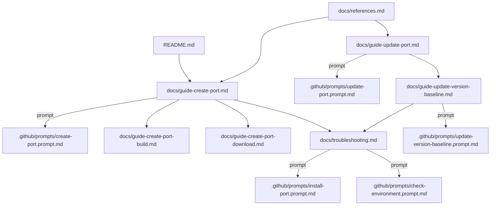

# GitHub Copilot Instructions: vcpkg-registry maintenance

## Introduction

This vcpkg registry provides an overlay of custom ports for the vcpkg package manager. This file defines how GitHub Copilot should assist with repository maintenance tasks.

For repository overview and setup instructions, see [README.md](../README.md).

## Core Maintenance Tasks

The primary maintenance tasks for this registry are:

### 1. Create Port
**Goal:** Add a new vcpkg port to this registry.

**Documentation:**
- [README.md](../README.md) – Setup and environment
- [docs/guide-create-port.md](../docs/guide-create-port.md) – Main creation guide
- [docs/guide-create-port-build.md](../docs/guide-create-port-build.md) – Build patterns
- [docs/guide-create-port-download.md](../docs/guide-create-port-download.md) – Download & SHA512

**Prompts:**
- `/search-port`
- `/create-port`
- `/install-port`
- `/review-port`

### 2. Update Port
**Goal:** Update an existing port to a newer version or adjust its build configuration.

**Documentation:**
- [docs/guide-update-port.md](../docs/guide-update-port.md) – Update procedures

**Prompts:**
- `/check-port-upstream`
- `/update-port`
- `/install-port`
- `/review-port`

### 3. Update Version Baseline
**Goal:** Synchronize `versions/` JSON files with changes to ports.

**Documentation:**
- [docs/guide-update-version-baseline.md](../docs/guide-update-version-baseline.md) – Baseline update procedures

**Prompts:**
- `/update-version-baseline`

### 4. Troubleshoot Port
**Goal:** Diagnose and fix issues with port installation or build.

**Documentation:**
- [docs/troubleshooting.md](../docs/troubleshooting.md) – Common issues and solutions

**Prompts:**
- `/check-environment`
- `/install-port`
- `/review-port`

## How Copilot Should Use Documentation

When assisting with tasks:

1. **For setup and environment:** Reference [README.md](../README.md) and [docs/references.md](../docs/references.md)
2. **For step-by-step instructions:** Use the specific guides in `docs/`:
   - docs/guide-create-port.md
   - docs/guide-update-port.md
   - docs/guide-update-version-baseline.md
   - docs/troubleshooting.md
3. **For external resources:** Use docs/references.md
4. **Prompt behavior must follow the corresponding guide's process**

## How Copilot Should Use Prompts

### Task-to-Prompt-to-Guide Mapping

| Task | Prompts | Primary Guides |
|------|---------|----------------|
| **Create port** | `/search-port` → `/create-port` → `/install-port` → `/review-port` | guide-create-port.md, guide-create-port-build.md, guide-create-port-download.md |
| **Update port** | `/check-port-upstream` → `/update-port` → `/install-port` → `/review-port` | guide-update-port.md |
| **Update version baseline** | `/update-version-baseline` | guide-update-version-baseline.md |
| **Troubleshoot** | `/check-environment` → `/install-port` | troubleshooting.md |

### Prompt Guidelines

- Prompts are for **process execution** with clear pass/fail outcomes
- Each prompt should report structured results with ✅ ⚠️ ❌ indicators
- Follow the workflow defined in the prompt's corresponding guide

## Command Usage Guidelines

### Overlay Usage
- Use explicit CLI options (`--overlay-ports`, `--overlay-triplets`) instead of environment variables
- See docs/guide-create-port.md and docs/troubleshooting.md for examples

### Helper Scripts
Prefer helper scripts in `scripts/` when available:
- scripts/registry-add-version.ps1 – Update version baseline
- scripts/registry-format.ps1 – Format manifests

### Minimal Changes
- Keep changes focused on the requested task
- Avoid unrelated refactoring
- Test only what's relevant to the change

## Safety and Scope Constraints

- **No automatic commits** unless explicitly requested
- **Stay within task scope** – don't modify unrelated ports or versions
- **Run tests/installs only when relevant** to the requested change
- **Follow vcpkg best practices** as documented in guides

## Navigation Graphs

### Mermaid Diagram

