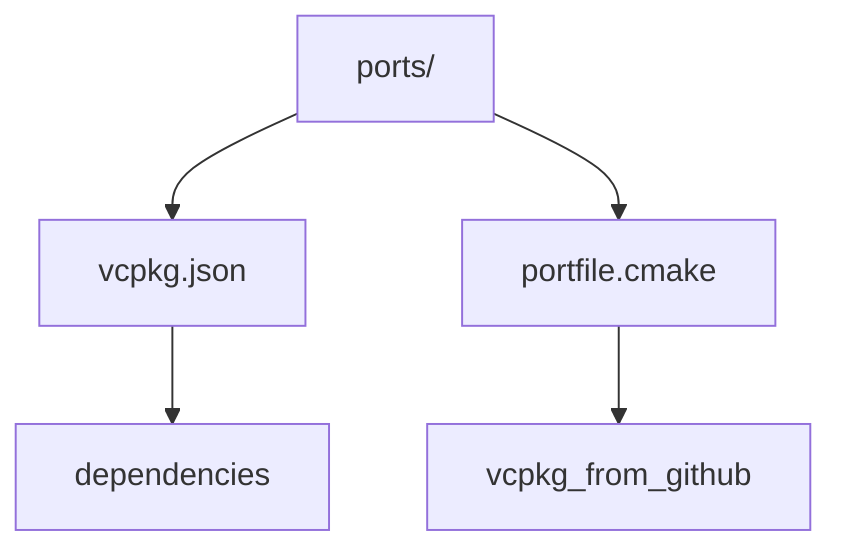
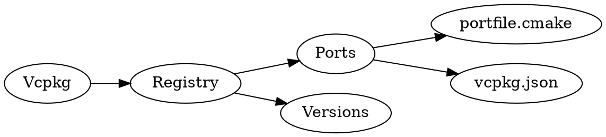

This page is a placeholder to test diagram rendering.

## Mermaid

```mermaid
flowchart TD
  A[ports/] --> B[vcpkg.json]
  A --> C[portfile.cmake]
  B --> D[dependencies]
  C --> E[vcpkg_from_github]
```

## Graphviz (DOT)

```dot
digraph G {
  rankdir=LR;
  Vcpkg -> Registry;
  Registry -> Ports;
  Registry -> Versions;
  Ports -> "portfile.cmake";
  Ports -> "vcpkg.json";
}
```
