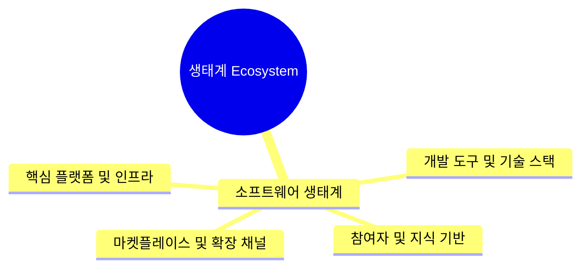
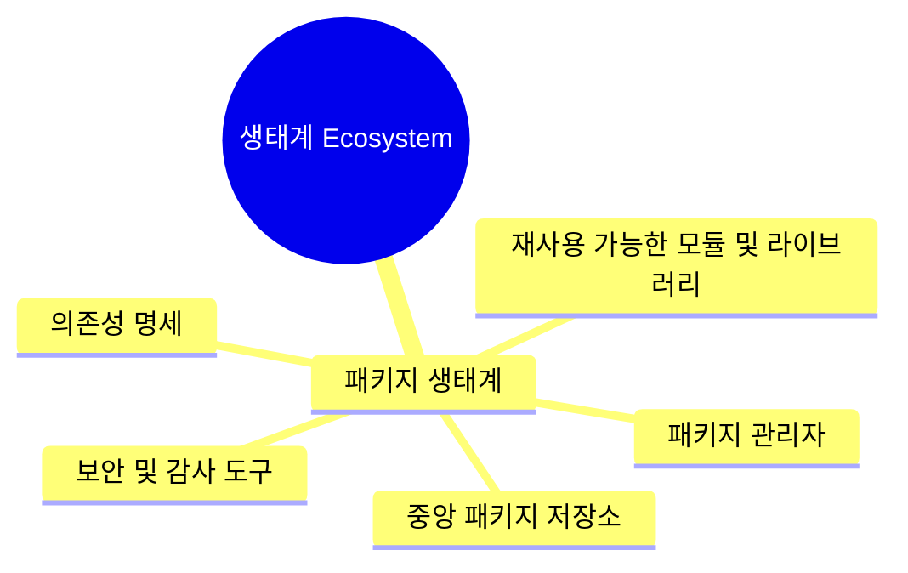

# C++ 패키지 매니저 생태계 운영하기: 개인 실험을 넘어서 개발 조직의 도구로 확장해온 여정 (2021~2025)

- Author: 박동하. C++ Korea User Group. LINE+ S/W Engineer
- Contact: luncliff@gmail.com luncliff@cppkorea.org dong-ha-park@linecorp.com
- Date: 2026. 8. 1.

vcpkg의 Registry 기능을 활용해 C++ 의존성을 직접 제어해온 5년간의 기록입니다. 팀 내 필요한 오픈소스 라이브러리 지원부터 내부 프로젝트의 패키지화까지, 조직의 도구로 성장시킨 경험과 노하우를 공유합니다.

MARK: Table Of Content. Up to heading 3.
- Heading 2: A PowerPoint section
- Heading 3: PowerPoint slides(1 or more)

MARK: Presentation에서는 완전한 문장을 사용하지 않고, 핵심 단어와 시각화를 중심으로 구성합니다. 화면의 복잡도를 낮춰서 읽기 부담을 줄여야 합니다. 가득 채워야 하는 경우, 2장 이상의 슬라이드로 분할하여, 점진적으로 내용을 이전 slide에 누적시키며, 순서대로 청중이 이해할 수 있도록 만듭니다. 더 자세한 사항들은 PPT 파일의 slide note로 삽입해서 공개버전을 다운로드 받은 청중이 활용할 수 있도록 지원합니다.

## 도입부

발표 전체의 Why - What - How 맥락을 내러티브로 설명합니다.

제목을 좀 풀어서 설명해야할 것 같다.
"C++ 패키지 매니저 기능을 사용해서 패키지 생태계 지원하기"

### 생태계라는 용어에 대해서

MARK: 소프트웨어 생태계를 설명 없이 사용하면, 오해를 불러일으키기 쉬운 단어가 된다. Wikipedia에서 설명하는 용어와, 발표 전체의 맥락을 한번 이어줄 필요가 있다. 시각화 중요함. 

소프트웨어 생태계 -> 패키지 생태계와 공급망 개념 -> vcpkg, C++ 영역에서 패키지들 운영




### 의문(Why): 왜 이 문제를?

우리 팀에서 만드는 라이브러리, 프레임워크를 더 쉽게 사용할 수 있어야 하지 않나?
개발자들은 자기 환경에 필요한 도구를 설치할 때 WinGet, APT, Homebrew 다 사용하면서...?

어째서 다같이 익숙한 패키지 매니저로 사용할 수 있도록 지원하지 않지?

```
winget install --id Microsoft.VisualStudioCode --scope machine
```
```
brew install opencv python@3.12
```

우리 조직에서 만든 산출물도 저렇게 지원해야 하는거 아닌가?
Android 빌드에서 AAR을 배포하는 상황 이외에는 이런 부분이 매우 미비했음.

### 분석: C++ 세계에서 의존성/공급망 문제(Problem)

- C++ 언어 사용자의 넓고 다양한 스펙트럼
  - 과거와는 달리 다수의 프로그래밍 언어를 조합하는 사례 증가
  - 컴파일러마다 다른 명령방식, 언어명세 구현, 오류 메시지 구조
  - 분야에 따라서 양상이 달라지기도.
- 프로그래밍 언어에 대한 지식수준과는 별개로 빌드 관리 전반에 대한 지식에 편차가 확대
  - 개발 환경이 다르면, 지식과 경험이 호환되지 않는 경우도 발생. Linux -> Windows. 
  - 각자가 경험한 프로젝트 관리방식이 매우 상이함. 특히 의존성 관리와 배포 구성.
- 낮은 패키지 매니저 사용률
  - 패키지 부족에 의한 불편함.
  - 패키지 매니저를 지원하지 않으면, 직접 빌드해서 산출물을 별도로 관리.
  - 작성해놓고 관리하지 않는 빌드 스크립트. (source of truth)

### 목표(What): 무엇을 할 것인가?

- 내가 속한 "개발조직의 역량(organization's ability)"에 대한 비전.
- 일관적이고, 확장가능하고, 제어 가능한 "개발체계(system)"에 대한 열망.

어차피 직무상 Dependency Graph 정리도 대대적으로 진행해야 하고, CMake도 도입해야 한다.
바로 vcpkg 지원부터 시작하자!

### 방법(How): vcpkg 패키지 공급과 registry 운영이 가능한 토대를 구축한다

2021년. Microsoft C++ Team Blog에 vcpkg registry 기능이 추가됨
- https://devblogs.microsoft.com/cppblog/how-to-start-using-registries-with-vcpkg/

기능 분석 후 판단.
- 당시 vcpkg 사용기간과 누적경험, 본인 역량으로 충분히 maintainer 다수와 견줄수 있다는 계산.
- 새 vcpkg feature를 사용하면 이후 사용 경험도 크게 개선될 것으로 예상함.

## C++ 의존성 구조의 근본적 난제

발표를 듣는 청중이 C++ 프로그래밍 언어와 vcpkg 패키지 매니저 영역에서 발생하는 문제를 더 쉽게 이해할 수 있는 기초를 제공합니다.

### Pre-processor에서 C++ Modules로 전환하는 과도기

- Pre-processor: `#include`에서 코드(.h, .hpp) 내용을 그대로 복제하고, `#define` 치환 작업.
- C++ Modules: `import`로 컴파일러가 해석 가능한 binary로 관리. 코드 복제 때문에 발생하는 비용 소거.

### Compile 오류

Pre-processor 구조의 취약성

- 기본적으로 소스코드를 복사-붙여넣기로 크게 확장하기 때문에, 오류 발생시에 분석 범위가 크게 증가
- 배포한 소스코드가 올바르게 사용되려면 많은 조건이 일치해야 함
  - `#include`를 작성한 사용자가 동일한 `#define` 집합 사용.
  - include 순서가 달라지면, macro processing 결과가 달라지거나, identifier 인식에 문제가 생긴다.
  - 생산자/소비자가 Compiler Toolchain (MSVC, Clang, GCC, etc.) 공유

컴파일 단계에서 발생한 불일치 문제가 숨겨져있다가 나타나는 경우

- symbol visibility 옵션 -> symbol은 분명히 존재하지만, undefined symbol 오류 발생
- `#define` macro를 사용한 dllexport/dllimport trick.

### Linker 오류

프로그램 binary를 만드는 것은 고전적인 천공테이프 타래를 만드는 것과 유사함.
static/shared 프로그램 개념 설명 약간 필요.

- 다수에서 shared 프로그램들 사이에서 symbol이 중복
- static 프로그램을 모두 모았는데 missing symbol이 발생

소프트웨어 분할과 조직화 상태에 대해서 면밀하게 관리가 필요.

### 문제들이 일으키는 현상

- 배포/재사용의 단위가 binary 형식이 아니라, 소스코드를 필요로하는 text interface를 추가로 요구한다: 이론적으로 Linkage 단계에서는 .lib, .a 파일만 있으면 프로그램을 만들 수 있으나, 소스코드를 작성하려면 Compile 단계에 그 내용을 전달해야 하는데, 사람을 위해서라도 .h 파일을 같이 배포.
- header-only 라이브러리 비중 증가: compile, linker 단계를 모두 버리고 소스코드를 그대로 전파하는데 집중. 전처리 결과에서 비대해진 컴파일 시간.
  - 의존성 구조가 소스코드와 결합. 같거나 '조금' 달라진 내용이 서로 다른 Translation Unit들에 내장됨. Dependency Graph 후반에 나중에 가서야 symbol 중복 발생.
- 빌드 도구 설정이 복잡해짐: macro, compiler option, linker option 조합 복잡도가, dependency 복잡도와 비례한다. 이상적으로 관리하고 있다면, 2개 복잡도는 서로 상관성이 낮거나, 없어야 함. 하지만 실제로는 define 목록, include 경로, library 경로 등이 계속 추가된다.
   - 독립적인 관리를 포기한 source embedding 발생

## vcpkg 패키지 매니저

질문: 의존성 문제는 공학적으로 접근해서 풀어내면 되는것 아닌가? C++ 생태계에서는 패키지 매니저를 사용하지 않나요?

JetBrains Developer Ecosystem Survey 2021~2025.
- C++ 개발자 생태계에서 패키지 매니저 사용률 추이.
- vcpkg 관련 정보를 추려서 해설.

MARK: 해석은 발표자가 나중에 추가할 예정. 발표 slide는 정보에 집중.

MARK: 이 영역은 vcpkg concept들을 시각화해서 보여주는 것이 중요. 화면 내에 너무 많은 정보가 한번에 제공되어서는 안됨.

### vcpkg: manifest

사용자 입장에서 vcpkg.json 구조와 field들의 의미에 대해서 시각화. CLI 명령으로 설치 전후를 비교.

- https://learn.microsoft.com/en-us/vcpkg/concepts/manifest-mode
- https://learn.microsoft.com/en-us/vcpkg/reference/vcpkg-json

과거에는 단순히 패키지 이름들을 사용했지만, 이제는 특정 버전으로 고정하거나, `>=version`같은 필드로 제어할 수 있음.

MARK: vcpkg.json 파일 예시 필요함

### vcpkg: port

- https://learn.microsoft.com/en-us/vcpkg/concepts/ports
- https://learn.microsoft.com/en-us/vcpkg/maintainers/variables

- vcpkg 세계에서 패키지를 의미하는 용어. 더 구체적으로는 소스코드에서 빌드 결과물(artifact)를 생성하기 위한 절차를 정의한 것. portfile.cmake에는 여러 단계가 모두 포함되어있음: 소스 및 도구 확보, 빌드 시스템 파일 생성, 빌드 진행과 설치, 설치 후 검증

MARK: portfile.cmake, vcpkg.json 파일 예시 필요함

주의와 강조가 필요한 지점: port를 작성할 때 사용하는 vcpkg.json 파일과(공급), vcpkg를 사용하는 쪽(소비)에서 사용하는 vcpkg.json은 규격이 조금 다르지만, 거의 호환 가능한 구조를 사용한다.

- 따라서 라이브러리/프레임워크를 개발하면서 vcpkg.json을 사용하고 있다면, 잠재적으로 vcpkg port를 지원하는 것도 가능하다.

### vcpkg: triplet

- https://learn.microsoft.com/en-us/vcpkg/concepts/triplets
- https://learn.microsoft.com/en-us/vcpkg/users/triplets

MARK: CMake 문법으로 작성된 Triplet 파일 code snippet 예시 필요. `VCPKG_*` 변수들이 각각 어떻게 빌드 환경과 도구에 연결되는지 시각화 필요함.

### vcpkg: host dependency

- https://learn.microsoft.com/en-us/vcpkg/users/host-dependencies
- https://learn.microsoft.com/en-us/vcpkg/concepts/supported-hosts
- cross compile 용어를 사용할 때, target platform, host platform 차이에 대해서 설명.
- host(빌드를 수행하는 플랫폼)에서 사용하는 의존성을 host dependency라고 부른다. 예) Python 프로젝트들의 dev dependency, test dependency 등

### vcpkg: overlay port, overlay triplet

MARK: 이미 사용중인 port, triplet concept 관련 슬라이드 위에 덧그리는 방식으로, "overlay"를 표현해낸다.

- https://learn.microsoft.com/en-us/vcpkg/concepts/overlay-ports

Git 저장소 예시. 자신만의 port 폴더들을 추가해서, vcpkg upstream에서 지원하지 않는 외부 라이브러리를 정식 port처럼 사용할 수 있다.


### Q. overlay 기능이 가지는 의의?

- vcpkg 전체를 fork 할 필요가 없어졌다. 필요한 port, triplet만 작성해서 관리할 수 있다.
- 간단한 환경변수로 opt in/out 가능
  - https://learn.microsoft.com/en-us/vcpkg/users/config-environment
- 다수의 overlay를 조합해서 원하는 패키지 조합을 구성할 수 있다.

### vcpkg: registry

port, triplet 구조는 vcpkg CLI를 사용해서 호출하는 수많은 CMake script 집합이라고 설명할 수 있다.

- https://learn.microsoft.com/en-us/vcpkg/concepts/registries
- https://learn.microsoft.com/en-us/vcpkg/reference/vcpkg-configuration-json
- vcpkg registry 동작 과정의 상세한 내용보다 시각화가 중요하다. 다수의 registry를 조합하는 vcpkg-configuration.json을 예시로 보여준다. X축을 시간(t)으로 사용하고, Y축은 다수의 vcpkg registry들이 제공하는 git stream들 (y축 가장 위에는 vcpkg upstream. 즉, Microsoft/vcpkg 저장소)을 배치한다. 임의의 시점, 임의의 commit들을 수직으로 바느질 하듯이 꿰어서 baseline을 만든다. 이 baseline의 결과물이 바로 vcpkg-configuration.json

단순한 overlay 사용법과는 다르게, versions 폴더 관리가 필요함. git 저장소로 공개하는 경우, 기본 branch에서 제공하는 versions/ 폴더와 port들이 정확히 맞아야한다.

### Q. vcpkg registry 기능이 가지는 의의?

편의성: 다수의 파일시스템 폴더에서 port 파일들을 관리해야 함. registry와 baseline은 이것을 형상관리 가능한 JSON파일로 지원. port, triplet의 재사용성 크게 강화.

MARK: JSON 파일 diff를 예시로 사용해서 port를 추가하거나, registry를 추가하는 것을 보여준다.

빌드 관리에서 고민해야 하는 포인트들
- 과거의 빌드를 다시 만들어낼 수 있는가? 특정 패키지만 과거의 버전을 사용할 수는 없나?
- 특정 시점에서 도구만 바꿔서 빌드할 수 있을까?

MARK: 시각화 포인트. vcpkg-configuration.json 조합을 예시로 보여준다. 특정 registry의 시간을 바꿔서, default registry는 최신으로 유지하면서, 특정 registry의 port 목록은 과거를 사용한다. 이 설정이 vcpkg.json을 통과하면서 dependency graph 결과가 달라진다.

## 패키지 관리 전략 수립

이 영역에서는 소프트웨어 엔지니어의 시점에서, 개발조직에서 사용가능한 패키지 생태계를 고민하는 과정을 보여줍니다. 패키지를 사용하는 것 뿐만 아니라, 패키지를 만들고 공급할 수 있는 능력을 어떻게 형성하고, 유지할 것인지를 고민합니다.

- 층위(Layer): 임의의 재사용 단위가, 최종 시스템 아키텍처에서 어느 층위에 있는가? 저수준 인터페이스? 유틸리티? 하위 솔루션? 상위 라이브러리? 전체 Dependency Graph는 편제가 어떻게 되어있는가?
- 규모(Scale): 설명 가능한 물리구조와 논리구조를 설계. 패키지들, 나아가서 패키지 내에 있는 컴포넌트들이 서로 협력적으로 결합할 수 있도록 지원.
- 단계(Phase): SDLC는 여러 단계를 거치게 된다. 패키지를 필요에 의해서 도입하는 것 이외에도, 선제적으로 관리범위에 추가하고, OSS의 변화를 추적하고, 검증하는 작업을 반복. 조직간 패키지 공유 역시 여기에 포함된다.

### 배포 유연성에 대한 고민

Dependency Graph 전반부 또는 하위 Layer에 가까울수록 부담이 적다.
Graph 후반부 또는 상위 Layer에 가까울수록 빌드 설정과 오류가 곱연산으로 복잡해진다.

패키지 시스템 자체는 여전히 프로그램 생성 과정을 근본적으로 바꾼 것은 아니다. 여전히 공학적인 문제로 분석할 수 있다. 따라서 제품-일정-예산 삼각형을 가지고 접근해보는 것도 필요하다.
- 제품을 패키지로 변환하면 -> 개인 역량에 종속받지 않는 체계적인 과정의 결과물이 된다.
- 패키지 생태계를 활용하면 -> 규모의 경제를 통해서 관리 비용을 감축할 수 있다.

기존에 작성된 사항들을 패키지로 만들면서, 자연스럽게 패키지 공급을 위한 물리구조와 논리구조의 재편이 발생. 일관성 있는 규칙에 대해 다시 고민. 비즈니스 요구사항과 컴포넌트들의 명세를 재검토하기 좋은 지점. 리팩터링, 배포, 검증 단위의 조정이 발생.

### 문제 형태 다시보기(Reshape)

안티패턴: 개발자 역량으로 복잡한 의존성 문제를 해결 -> 유사한 문제가 발생했을 때도 해결할 수 있을까?

개발조직 관점: 공급망 관리는 기술(Technique) 문제 X. 위험(Risk) 문제 O.
- 업무 단위를 해결하는 질문: "왜 문제가 터지는걸까?"
- 운영 위험을 고민하는 질문: "어떻게 발생할 수밖에 없는 문제에 대응할 것인가?"

접근방법: 보험(Insurance) 모델
- 미리 비용을 지불해서 대응이 어려운 규모로 문제가 확장하는 것을 제한한다.
- 지속적으로 공급망을 점검하고, 검증할 필요성

### 조직 규모에 따라서 관심사항을 재배치 한다면?

| Layer | 개인(Person) | 조직(Organization) | 법인(Enterprise) |
|-----|-----|-----|-----|
| Issues | - 도구전문성 <br> - 컴포넌트, 서브시스템, 패키지 설계 분별력 <br> - 멘탈 모델 | - 협력 조직과의 공급망 설계/운영 <br> - 소비/생산 역량관리 <br> - 제품 특성 고민(하향식/연계성/변경성 <-> 상향식/재사용성/안정성) | - 소프트웨어 자본화 <br> - 공급망 거버넌스, 검수체계 <br> - 개발조직들이 공유 가능한 인프라 |

### 관점: 소프트웨어 자본

MARK: Large Scale C++ Volume 1: Practices and Architecture 책에서 제시하는 Software Capital 개념으로, 개발조직의 산출물을 패키지 공급망에 참여시키는 것이, 조직/회사 차원의 자산화 관점에 유익하다는 점을 설명

### 사내 소프트웨어는 아키텍처에 대한 시야가 필요

- 최종 소프트웨어에 포함하는 배포단위(Unit of Release)들을 어떻게 분할할 것인지. 관여하는 조직간에 패키지 공유 수준을 어떻게 맞출 것인지.
- 전체 Dependency Graph의 종단일 때(Application)와, 종단이 아닐 때(Library, Framework), Dependency 층위가 복합적일 때 (Development Kit 규모, CLI tool support, etc.)

## 패키지 생태계 운영

그렇다면 우리 조직에서 사용하는 외부 라이브러리들을 어떻게 분배하는 것이 전략적인가?

- 하위 Layer(작은 단위)는 빠르게 갱신될 수 있는 영역 -> vcpkg upstream
- 상위 Layer(큰 단위)는 검증할 수 있고, 수정할 수 있는 영역 -> internal/private vcpkg registry

upstream 영역에 있는 패키지들은 상태계의 도움을 받는다.
- 지속적으로 latest 업데이트가 발생 -> 사내에서 문제가 발생했을 때, 이미 제보된 것인지 확인 가능하다. (추적 상황에서 소거법 분석에 도움)
- 실제 사용자가 있다면 지속적인 모니터링이 발생한다고 확신할 수 있다. (관리비용 공유)

우리 개발조직의 제품에서 잠재적 사용이 예상된다면, vcpkg upstream에 미리 기여한다.
- 개발조직 내 역량이 부족한 상황이 발생할 수 있다. 이때는 생태계에서 도움받는다. public space에서는 충분히 많은 사람들이 검토해줄 수 있다.
- 소스코드 관리가 아니라, 패키징 관련 사항이라는 점이 중요하다. upstream에서 성공적으로 관리 중이라면, 신뢰의 기본선을 높일 수 있다. 패키지 도입의 비용이 감소한다.

### 개인적 수준: In Open Source Community

개인적 흥미와 노하우 축적은 개인 vcpkg registry를 사용한다. 목적은 확장보다 관리/운영 경험 축적.
- 선택과 집중: 흥미 본위로 선정한 환경에서, 가장 익숙한 도구를 사용.
- 지속적으로 배포가 발생하는 중규모 빌드시스템 복잡도를 가진 C++ 프로젝트.
   - OpenSSL: 빌드 과정에서 Perl 사용
   - TensorFlow Lite: 소규모 라이브러리 사용이 많음
   - NVIDIA CUDA 관련(CUDNN, Triton, etc.): CUDA 빌드 과정에서 발생하는 오류 경험
   - Apple CoreML Tools: Python + Xcode

지속적인 관리가 필요하고, 공익성이 있는 대규모 C++ 프로젝트는 vcpkg registry에서 실험 후, upstream 으로. vcpkg 팀에서 운영하는 CI로 검증한다.
- Gstreamer: Meson 빌드시스템
- libtorch: PyTorch의 C++ 코드 및 관련 dependency 전체
- Microsoft QUIC: 자체적으로 수정한 OpenSSL 변형
- ONNX, ONNX Runtime: GPU 관련 빌드 지원으로 인해 높은 복잡성. 실무적 필요
- ImGui: WebGPU 빌드 지원
- 기타 community의 요청이 있는 라이브러리들

### 조직 수준: In Enterprise

LINE GitHub Enterprise에서도 vcpkg-registry 생성.

- 재현가능한 빌드: 다양한 조합의 baseline을 검증
- 사내 저장소들을 사용해서 빌드
  - 빌드 절차와 옵션들을 CMake로 재작성. OSS 보다 더 철저하게 경량화. 복잡성 차단
  - 분산되어 있던 patch 파일을 수집해서 port에 내장
- 팀원들이 사용하는 빌드 도구에 맞게 triplet 구성

회사/팀에서 지원하는 도구들을 사용해서 CI(GitHub Actions) 설정

- 각 target platform마다 필요한 port들을 검증하는데 집중
- 6개월 이전까지 전체 dependency들의 시간을 되돌릴 수 있도록, job matrix 설계
- 새로운 OSS 버전이 출시되면 -> branch 생성 후 port 갱신 -> 빌드 log 파일을 사용해서 오류를 사전 확인하는 구조
- 사내에서 지원하는 도구가 바뀌면 그에 맞게 대응: GitHub Hosted Runner 기준이 아니라, Enterprise Runner에 맞게 Docker image 준비 및 Container Registry 운영.

### Enterprise 환경에서 제약/한계/비용

패키지 생태계를 만드는 이유: 다른 개발조직이 우리 개발조직의 자산을 쉽게 활용할 수 있도록 만든다.

- 사내 private Git 저장소들에 접근하기 위한 권한 및 Secret 관리.
- 빌드 과정에서 필요한 빌드 머신 메모리를 충족하기 어려운 경우, 빌드 규모 분할이 필요
   - 패키지 생태계에 합류하기 위해서는, 응집성과 배포단위(Unit of Release)를 신중하게 설계 필요. 라이브러리라면 분할과 함께 인터페이스 재설계가 필연적.
   - 최선의 방법은 소스코드를 경량화 하는 것. C++ 표준 라이브러리로 대체하거나, 시스템에서 제공하는 SDK를 최대한 활용해서 코드 수준에서 군살을 없앤다.
- vcpkg에서 지원하는 binary caching 기능을 사내 Object Storage에 연결해서 전체 소요시간 단축
   - 검증 단계에서, ZIP으로 압축된 artifact들이 약 70~80 GB 규모를 유지.
   - 빌드 결과물은 사내 Nexus repository에 업로드해서 metadata와 함께 보존.

## 마치며

### 교훈

그래도 결국은 도구에 대한 이해도가 높아지지 않으면 결국 빠르게 한계가 찾아온다.
이해도가 중요한 것은 공급망에 기여하는 과정에서 접하는 문제 영역이 넓기 때문이기도 하지만, 질문에 대해서 사고하는 것을 도와주기 때문.

### 예를 들어보면?

- 우리 C++ 프로젝트가 S-BOM을 요구받으면 어떻게 대응할 것인가?
  - vcpkg는 이미 feature를 지원하고 있음. https://learn.microsoft.com/en-us/vcpkg/reference/software-bill-of-materials
- 우리가 사용하는 라이브러리 중에서 [XZ Utils 백도어](https://en.wikipedia.org/wiki/XZ_Utils_backdoor) 사건 같은 경우가 발생하면 어떻게 대응할 것인가?
  - 보안 문제가 없는 버전으로 port 들을 수정하고, 직후 registry를 갱신한다. 
- 갑자기 3년 전에나 사용하던 빌드 도구에서 쓸 수 있게 다시 빌드해달라고 요청받으면 어떻게 할 것인가?
  - 도구 설치를 마치고 vcpkg triplet을 작성한다. 새 triplet에서 실패하는 port들이 있는지 확인한다.

### 보험 모델의 한계?

보험 상품이 있어도 가입하지 않으면 의미가 없다.
층위와 규모를 키우게 되면, 결국 조직 수준에서 Why-What-How 정의해야 한다.

내가 속한 조직의 제품과 관련된 패키지들을 모두 관리할 수 있다는 것은 허상(Fantasy). 목적(Why)은 어디까지나 최종적으로는 관리 가능한 수준으로 유지하는 것. 패키지 매니저를 도입하고, 패키지 생태계를 구성하는 것은 build managment 비용을 registry라는 자산으로 변환 하는 방법(What, How)의 영역.

### 결론

근본적으로 이 문제는 종결조건이 있는 것은 아님.
계속해서 변화하는 도구들과, 소프트웨어의 흐름을 따라가는 과정.

하지만 OSS에서 만들어나가는 생태계를 받아들이고, 복제하고, 운영하면서 그 흐름을 더 쉽게 사용할 수 있다. 소프트웨어를 지속적으로 사용가능한 자산으로 만들 수 있다.

다시 돌이켜보는 첫 시작점: 우리 팀에서 만드는 제품을 CLI 명령 또는 설정파일 N줄로 사용할 수 있어야 하지 않나?
