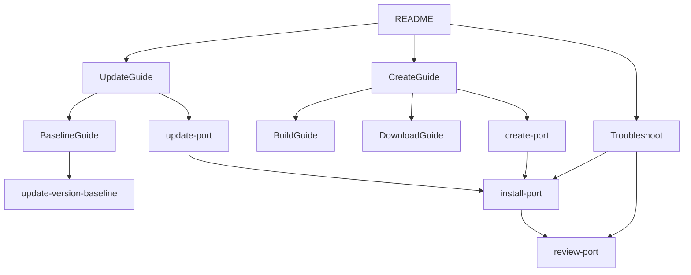
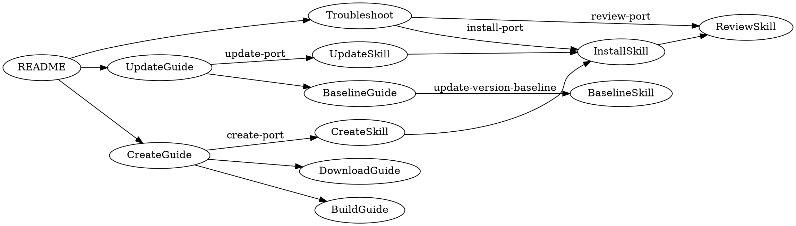

# Agent Skills Design for vcpkg-registry

Canonical design spec for GitHub Copilot agent skills and their relationship to guides.

## Purpose & Scope
- Capture skill + guide alignment for registry maintenance (create/update ports, update version baseline, troubleshoot, environment checks).
- Define naming, reporting, and workflow expectations for all repository skills.
- Skills use the Agent Skills standard and live in `.github/skills/<skill-name>/SKILL.md`.
- Guides explain what/why and provide stepwise CLI snippets; skills drive execution with deterministic reports (pass/fail).
- Logging: no work-note.md; use PR descriptions and commits.

## Vocabulary & Naming
- Tasks: Create port, Update port, Update version baseline, Troubleshoot, Check environment.
- Skills follow Verb–Noun naming and live in `.github/skills/<skill-name>/SKILL.md`.

## Artifact Map (Guides ↔ Skills)
- 📝 [guide-create-port.md](./guide-create-port.md) → 🛠️ [create-port](../.github/skills/create-port/SKILL.md)
   - [guide-create-port-download.md](./guide-create-port-download.md)
   - [guide-create-port-build.md](./guide-create-port-build.md)
- 📝 [guide-update-port.md](./guide-update-port.md) → 🛠️ [update-port](../.github/skills/update-port/SKILL.md)
- 📝 [guide-update-version-baseline.md](./guide-update-version-baseline.md) → 🛠️ [update-version-baseline](../.github/skills/update-version-baseline/SKILL.md)
- 📝 [troubleshooting.md](./troubleshooting.md) → 🛠️ [install-port](../.github/skills/install-port/SKILL.md) (for logs), [review-port](../.github/skills/review-port/SKILL.md) (for validation)
- 📝 [README](../README.md) + [References](./references.md) → 🛠️ [check-environment](../.github/skills/check-environment/SKILL.md)

## Skill Set

Skills in [.github/skills](../.github/skills/) folder:

- `check-environment`: detect OS/shell/tools, validate vcpkg root/registry structure.
- `search-port`: find ports locally/upstream, summarize versions/deprecation, recommend next step.
- `create-port`: acquire source, generate vcpkg.json/portfile, checksum, prep for install.
- `install-port`: run vcpkg install with overlays, parse logs, classify errors, report artifacts.
- `review-port`: validate manifest/portfile/patches against guidelines; emit pass/fail.
- `check-port-upstream`: compare local vs upstream project vs microsoft/vcpkg; flag updates.
- `update-port`: bump version/ref/sha512, test with --editable, report upgrade status.
- `update-version-baseline`: run registry-add-version.ps1 to sync versions/ baseline.

## Reporting Conventions
- Each skill defines required headings and pass/fail outcome; no free-form prose.
- Reports include command snippets (PowerShell), key artifacts, and next-step recommendations.
- Emojis: ✅ success, ⚠️ warning/experimental, ❌ failure.

## Workflow Navigation

### Mermaid

### Graphviz

