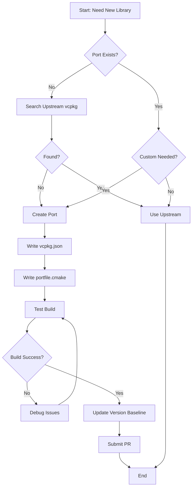
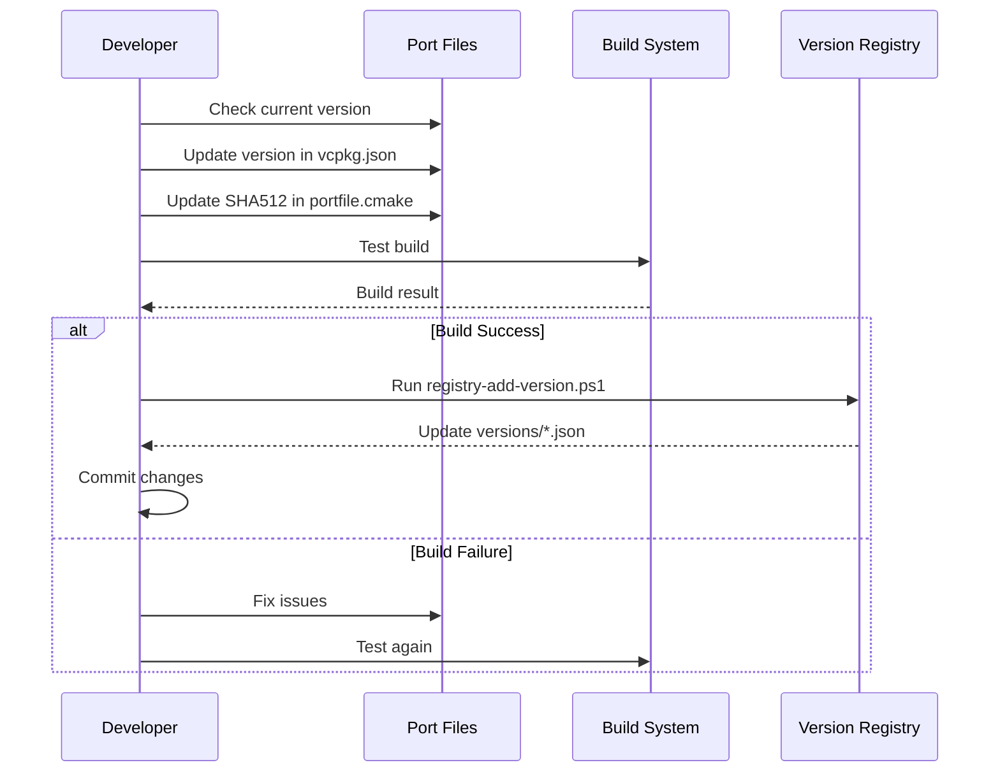
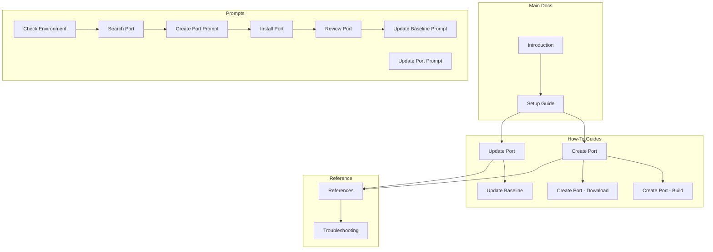

# vcpkg-registry Workflows

This page demonstrates Mermaid diagram support in Docusaurus and documents key workflows.

## Port Creation Workflow

The following diagram shows the typical workflow for creating a new port:



## Port Update Workflow

When updating an existing port to a new version:



## Prompt Workflow

GitHub Copilot prompts follow this workflow:

```mermaid
graph LR
    A[User Task] --> B{Task Type?}
    B -->|New Port| C[/search-port]
    C --> D[/create-port]
    D --> E[/install-port]
    E --> F[/review-port]
    B -->|Update Port| G[/check-port-upstream]
    G --> H[/update-port]
    H --> E
    F --> I[/update-version-baseline]
    I --> J[Complete]
    H --> J
```

## Navigation Graph

This graph shows how the documentation is organized:



## Related Documentation

- [Create Port Guide](guide-create-port)
- [Update Port Guide](guide-update-port)
- [Troubleshooting](troubleshooting)
