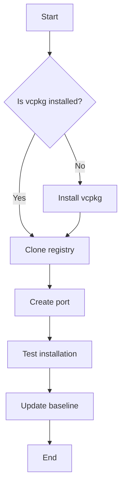
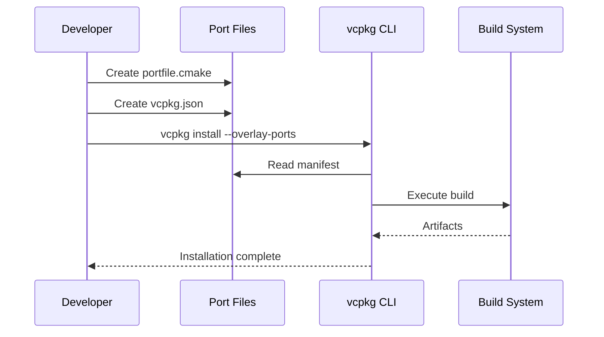
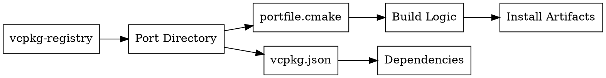

## Mermaid Diagrams

This documentation site has built-in support for [Mermaid](https://mermaid.js.org/) diagrams. You can create flowcharts, sequence diagrams, class diagrams, and more using simple text-based syntax.

### Example: Flowchart



### Example: Sequence Diagram



## Graphviz Diagrams

For more complex diagrams that require Graphviz, we recommend the following approaches:

### Approach 1: Pre-render to SVG (Recommended)

1. Install Graphviz locally: `apt install graphviz` or `brew install graphviz`
2. Create your `.dot` file with your diagram definition
3. Render to SVG: `dot -Tsvg input.dot -o output.svg`
4. Place the SVG file in `src/assets/` directory
5. Import and use in your MDX file:

```mdx
---
title: My Page
---

import MyDiagram from '../../assets/output.svg';


```

### Approach 2: Client-side Rendering

For dynamic Graphviz rendering, you can use `@hpcc-js/wasm`:

1. Install the package: `npm install @hpcc-js/wasm`
2. Create a custom Astro component that wraps the WASM renderer
3. Import and use the component in your pages

**Note:** This approach requires JavaScript to be enabled in the browser and may impact initial page load time.

### Example Graphviz Syntax



For now, we recommend using **Approach 1** (pre-rendering to SVG) for the best performance and compatibility. Mermaid diagrams should be used for most common diagram needs as they are natively supported and render efficiently.

## Best Practices

1. **Use Mermaid when possible**: It's built-in, fast, and works everywhere
2. **Keep diagrams simple**: Complex diagrams can be hard to maintain
3. **Add alt text**: Always provide descriptive alt text for accessibility
4. **SVG for complex graphs**: Use pre-rendered SVG for intricate Graphviz diagrams
5. **Document your diagrams**: Include the source `.dot` or `.mmd` files in version control

## Resources

- [Mermaid Documentation](https://mermaid.js.org/)
- [Graphviz Documentation](https://graphviz.org/documentation/)
- [Mermaid Live Editor](https://mermaid.live/)
