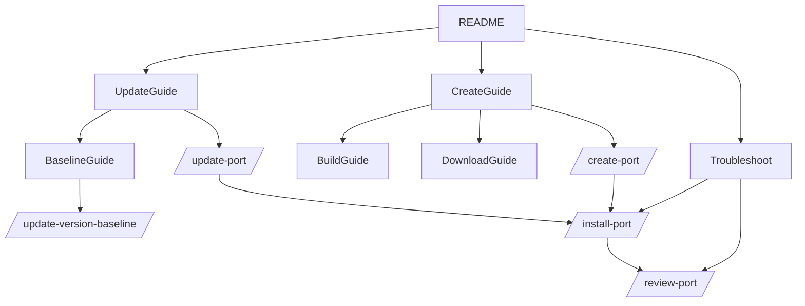
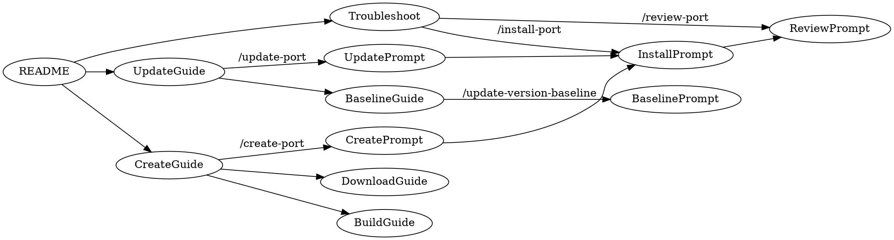

Canonical design spec for GitHub Copilot prompts and their relationship to guides. 

## Purpose & Scope
- Capture prompt + guide alignment for registry maintenance (create/update ports, update version baseline, troubleshoot, environment checks).
- Define naming, reporting, and workflow expectations for all repository prompts.
- Record decisions from the current overhaul: remove work-note logging, use "Create port" / "Update port" / "Update version baseline" terminology, and keep guides descriptive while prompts execute with pass/fail outcomes.

## Vocabulary & Naming
- Tasks: Create port, Update port, Update version baseline, Troubleshoot, Check environment.
- Prompts follow Verb–Noun naming and live in .github/prompts/*.prompt.md.
- Guides explain what/why and provide stepwise CLI snippets; prompts drive execution with deterministic reports (pass/fail).
- Logging: no work-note.md; use PR descriptions and commits.

## Artifact Map (Guides ↔ Prompts)
- 📝 [guide-create-port.md](./guide-create-port.md) → 🛠️ [create-port.prompt.md](../.github/prompts/create-port.prompt.md)
   - [guide-create-port-download.md](./guide-create-port-download.md)
   - [guide-create-port-build.md](./guide-create-port-build.md)
- 📝 [guide-update-port.md](./guide-update-port.md) → 🛠️ [update-port.prompt.md](../.github/prompts/update-port.prompt.md)
- 📝 [guide-update-version-baseline.md](./guide-update-version-baseline.md) → 🛠️ [update-version-baseline.prompt.md](../.github/prompts/update-version-baseline.prompt.md)
- 📝 [troubleshooting.md](./troubleshooting.md) → 🛠️ install-port (for logs), review-port (for validation)
- 📝 [README](../README.md) + [References](./references.md) → 🛠️ [check-environment.prompt.md](../.github/prompts/check-environment.prompt.md)

## Prompt Set

List the *.prompt.md files in [.github/prompts](../.github/prompts/) folder.

- /check-environment: detect OS/shell/tools, validate vcpkg root/registry structure.
- /search-port: find ports locally/upstream, summarize versions/deprecation, recommend next step.
- /create-port: acquire source, generate vcpkg.json/portfile, checksum, prep for install.
- /install-port: run vcpkg install with overlays, parse logs, classify errors, report artifacts.
- /review-port: validate manifest/portfile/patches against guidelines; emit pass/fail.
- /check-port-upstream: compare local vs upstream project vs microsoft/vcpkg; flag updates.
- /update-port: bump version/ref/sha512, test with --editable, report upgrade status.
- /update-version-baseline: run registry-add-version.ps1 to sync versions/ baseline.

## Reporting Conventions
- Each prompt defines required headings and pass/fail outcome; no free-form prose.
- Reports include command snippets (PowerShell), key artifacts, and next-step recommendations.
- Emojis: ✅ success, ⚠️ warning/experimental, ❌ failure.

## Workflow Navigation

### Mermaid

### Graphviz

